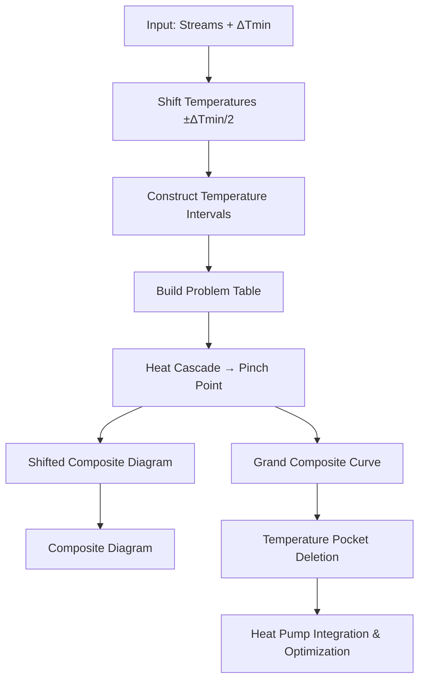

# Pinch Analysis

Pinch Analysis is the foundational calculation of HeatTransPlan. It determines the **minimum heating and cooling utility** requirements for a set of process streams, identifies the **Pinch Temperature**, and constructs the diagnostic curves (Composite Curves, Grand Composite Curve) that drive all downstream modules.

The implementation follows the classic methodology from Linnhoff & Hindmarsh (1983), extended to handle edge cases in multi-process industrial settings.

---

## Input: Process Streams

Every stream is defined by three numbers:

| Parameter | Symbol | Unit | Meaning |
|-----------|--------|------|---------|
| Heat capacity flow rate | $\dot{C}_P$ | kW/°C | Mass flow × specific heat capacity |
| Supply temperature | $T_S$ | °C | Temperature the stream starts at |
| Target temperature | $T_T$ | °C | Temperature the stream must reach |

A stream is classified automatically:

- **Hot stream**: $T_S > T_T$ — the stream needs to be cooled (releases heat).
- **Cold stream**: $T_S < T_T$ — the stream needs to be heated (absorbs heat).

The user also supplies a **minimum approach temperature** $\Delta T_{min}$, which is the smallest allowed temperature difference between a hot and a cold stream at any point of heat exchange.

<details>
<summary><b>Source code:</b> <code>backend/app/modules/pinch/streams.py</code></summary>

```python
# Classification logic in Streams.create_streams():
for rawStream in self._rawStreamsData[2:]:
    stream = {}
    if float(rawStream[1]) > float(rawStream[2]):
        stream["type"] = "HOT"
    else:
        stream["type"] = "COLD"

    stream["cp"] = float(rawStream[0])
    stream["ts"] = float(rawStream[1])
    stream["tt"] = float(rawStream[2])
    self.streamsData.append(stream)
```

</details>

---

## Step 1 — Shift Temperatures by ΔTmin/2

To guarantee that the minimum approach temperature $\Delta T_{min}$ is respected between hot and cold streams, we **shift** all stream temperatures before constructing any interval diagram:

$$
T_{shifted}^{hot} = T_{actual} - \frac{\Delta T_{min}}{2}
$$

$$
T_{shifted}^{cold} = T_{actual} + \frac{\Delta T_{min}}{2}
$$

**Why this works:** After shifting, whenever a hot and cold stream share the same shifted temperature, their actual temperatures are exactly $\Delta T_{min}$ apart. This guarantees feasible heat exchange without checking every pair.

Both supply and target temperatures of each stream are shifted:

- A hot stream at 200°C → 150°C with $\Delta T_{min} = 10$°C becomes 195°C → 145°C.
- A cold stream at 50°C → 120°C becomes 55°C → 125°C.

<details>
<summary><b>Source code:</b> <code>backend/app/modules/pinch/pinch.py</code> (lines 62–69)</summary>

```python
def shift_temperatures(self):
    for stream in self.streams:
        if stream['type'] == 'HOT':
            stream['ss'] = stream['ts'] - self.tmin / 2
            stream['st'] = stream['tt'] - self.tmin / 2
        else:
            stream['ss'] = stream['ts'] + self.tmin / 2
            stream['st'] = stream['tt'] + self.tmin / 2
```

</details>

---

## Step 2 — Construct Temperature Intervals

All unique shifted temperatures are collected and sorted in descending order. The gaps between consecutive temperatures form the **temperature intervals**.

For each interval $[T_i, T_{i+1}]$, we record which streams pass through it:

- A hot stream passes through the interval if its shifted supply temperature ≥ $T_i$ **and** its shifted target temperature ≤ $T_{i+1}$.
- A cold stream passes through if its shifted target temperature ≥ $T_i$ **and** its shifted supply temperature ≤ $T_{i+1}$.

<details>
<summary><b>Source code:</b> <code>backend/app/modules/pinch/pinch.py</code> (lines 78–129)</summary>

```python
def construct_temperature_interval(self):
    # Collect all shifted temperatures
    for stream in self.streams:
        self._temperatures.append(stream['ss'])
        self._temperatures.append(stream['st'])

    # Remove duplicates and sort descending
    self._temperatures = list(set(self._temperatures))
    self._temperatures.sort(reverse=True)

    # For each interval, find which streams are active
    for i in range(len(self._temperatures) - 1):
        t1 = self._temperatures[i]
        t2 = self._temperatures[i + 1]
        interval = {'t1': t1, 't2': t2, 'streamNumbers': []}

        j = 0
        for stream in self.streams:
            if stream['type'] == 'HOT':
                if stream['ss'] >= t1 and stream['st'] <= t2:
                    interval['streamNumbers'].append(j)
            else:
                if stream['st'] >= t1 and stream['ss'] <= t2:
                    interval['streamNumbers'].append(j)
            j += 1

        self.temperatureInterval.append(interval)
```

</details>

---

## Step 3 — Build the Problem Table

For each temperature interval, we compute:

1. **Temperature span**: $\Delta T_i = T_i - T_{i+1}$
2. **Net heat capacity**: $\Delta \dot{C}_{P,i} = \sum \dot{C}_{P}^{hot} - \sum \dot{C}_{P}^{cold}$ (summed over streams active in that interval)
3. **Enthalpy change**: $\Delta H_i = \Delta T_i \times \Delta \dot{C}_{P,i}$

The sign convention is:

- $\Delta H_i > 0$: the interval has a **net surplus** of heat (hot streams dominate).
- $\Delta H_i < 0$: the interval has a **net deficit** (cold streams dominate).

<details>
<summary><b>Source code:</b> <code>backend/app/modules/pinch/pinch.py</code> (lines 136–164)</summary>

```python
def construct_problem_table(self):
    for interval in self.temperatureInterval:
        row = {}
        row['deltaS'] = interval['t1'] - interval['t2']
        row['deltaCP'] = 0

        for i in interval['streamNumbers']:
            if self.streams.streamsData[i]['type'] == 'HOT':
                row['deltaCP'] += self.streams.streamsData[i]['cp']
            else:
                row['deltaCP'] -= self.streams.streamsData[i]['cp']

        row['deltaH'] = row['deltaS'] * row['deltaCP']
        self.problem_table.append(row)
```

</details>

---

## Step 4 — Heat Cascade and Pinch Point

The heat cascade is constructed in two passes:

### Pass 1: Unfeasible Cascade (no external utility)

Starting from the top (hottest interval), we cascade heat downward by accumulating $\Delta H$ values:

$$
\dot{Q}_{exit,i} = \dot{Q}_{exit,i-1} + \Delta H_i
$$

starting with $\dot{Q}_{exit,0} = 0$ (no utility). If any $\dot{Q}_{exit,i}$ goes negative, the cascade is **infeasible** — there is not enough heat available from above.

### Pass 2: Feasible Cascade

The minimum hot utility required is:

$$
\dot{Q}_{H,min} = -\min(\dot{Q}_{exit,i}^{unfeasible})
$$

We re-run the cascade starting with $\dot{Q}_{exit,0} = \dot{Q}_{H,min}$ instead of zero. Now all exit enthalpies are ≥ 0.

### Key results

| Result | Formula | Physical meaning |
|--------|---------|-----------------|
| **Pinch temperature** | $T_{pinch}$ = bottom of the interval where $\dot{Q}_{exit} = 0$ | Temperature where zero heat crosses — divides the problem into above-pinch (needs heating) and below-pinch (needs cooling) |
| **Minimum hot utility** | $\dot{Q}_{H,min}$ | External heating required (above the pinch) |
| **Minimum cold utility** | $\dot{Q}_{C,min}$ = final $\dot{Q}_{exit}$ | External cooling required (below the pinch) |

<details>
<summary><b>Source code:</b> <code>backend/app/modules/pinch/pinch.py</code> (lines 167–223)</summary>

```python
def construct_heat_cascade(self):
    # --- Pass 1: unfeasible cascade (starting from 0) ---
    exitH = 0
    lowestExitH = 0
    pinchInterval = 0

    for i, interval in enumerate(self.problem_table):
        row = {'deltaH': interval['deltaH']}
        exitH += row['deltaH']
        row['exitH'] = exitH
        if exitH < lowestExitH:
            lowestExitH = exitH
            pinchInterval = i
        self.unfeasible_heat_cascade.append(row)

    # --- Pass 2: feasible cascade (starting from Q_H,min) ---
    self.hot_utility = -lowestExitH
    exitH = self.hot_utility

    for interval in self.problem_table:
        row = {'deltaH': interval['deltaH']}
        exitH += row['deltaH']
        row['exitH'] = exitH
        self.heat_cascade.append(row)

    self.cold_utility = exitH
    self.pinch_temperature = self.temperatureInterval[pinchInterval]['t2']
```

</details>

---

## Step 5 — Shifted Composite Diagram

The **Shifted Composite Diagram** plots the cumulative enthalpy of all hot streams and all cold streams separately, using shifted temperatures. Each composite curve is a piecewise-linear function $T$ vs. $H$.

### Construction

For each temperature interval, the total enthalpy released by hot streams and absorbed by cold streams is:

$$
\Delta H_i^{hot} = \sum_{j \in hot} \dot{C}_{P,j} \times (T_i - T_{i+1})
$$

$$
\Delta H_i^{cold} = \sum_{j \in cold} \dot{C}_{P,j} \times (T_i - T_{i+1})
$$

The **hot composite** is built by accumulating $\Delta H^{hot}$ from the cold end upward (starting at $H = 0$).

The **cold composite** is built by accumulating from the hot end downward, starting at the total cold enthalpy plus the cold utility.

After construction, flat segments at the ends (where no streams are active) are trimmed off to produce clean curves.

<details>
<summary><b>Source code:</b> <code>backend/app/modules/pinch/pinch.py</code> (lines 226–321)</summary>

```python
def construct_shifted_composite_diagram(self, localisation):
    for interval in self.temperatureInterval:
        hotH = 0
        coldH = 0
        for i in interval['streamNumbers']:
            if self.streams.streamsData[i]['type'] == 'HOT':
                hotH += self.streams.streamsData[i]['cp']
            else:
                coldH += self.streams.streamsData[i]['cp']

        hotH = hotH * (interval['t1'] - interval['t2'])
        self._deltaHHot.append(hotH)
        coldH = coldH * (interval['t1'] - interval['t2'])
        self._deltaHCold.append(coldH)

    # Hot composite: accumulate from cold end
    self._deltaHHot.reverse()
    self.shifted_composite_diagram['hot']['H'].append(0.0)
    for i in range(1, len(self._temperatures)):
        self.shifted_composite_diagram['hot']['H'].append(
            self.shifted_composite_diagram['hot']['H'][-1] + self._deltaHHot[i-1]
        )
        self.shifted_composite_diagram['hot']['T'].append(
            self._temperatures[len(self._temperatures)-i]
        )
    self.shifted_composite_diagram['hot']['T'].append(self._temperatures[0])

    # Cold composite: start at total cold + cold utility
    coldgesamt = self.cold_utility
    for dH in self._deltaHCold:
        coldgesamt += dH

    self.shifted_composite_diagram['cold']['H'].append(coldgesamt)
    self.shifted_composite_diagram['cold']['T'].append(self._temperatures[0])
    for i in range(1, len(self._temperatures)):
        self.shifted_composite_diagram['cold']['H'].append(
            self.shifted_composite_diagram['cold']['H'][-1] - self._deltaHCold[i-1]
        )
        self.shifted_composite_diagram['cold']['T'].append(self._temperatures[i])

    # Trim flat ends off both curves (segments with no active streams)
```

</details>

---

## Step 6 — Composite Diagram (Actual Temperatures)

The Composite Diagram is obtained by **un-shifting** the temperatures from the Shifted Composite Diagram:

$$
T_{actual}^{hot} = T_{shifted}^{hot} + \frac{\Delta T_{min}}{2}
$$

$$
T_{actual}^{cold} = T_{shifted}^{cold} - \frac{\Delta T_{min}}{2}
$$

The enthalpy values ($H$) remain the same — only the temperature axis changes. The horizontal gap between the two curves at the pinch equals exactly $\Delta T_{min}$.

<details>
<summary><b>Source code:</b> <code>backend/app/modules/pinch/pinch.py</code> (lines 325–342)</summary>

```python
def construct_composite_diagram(self, localisation):
    self.composite_diagram['hot']['T'] = [
        x + self.tmin / 2
        for x in self.shifted_composite_diagram['hot']['T']
    ]
    self.composite_diagram['hot']['H'] = list(
        self.shifted_composite_diagram['hot']['H']
    )
    self.composite_diagram['cold']['T'] = [
        x - self.tmin / 2
        for x in self.shifted_composite_diagram['cold']['T']
    ]
    self.composite_diagram['cold']['H'] = list(
        self.shifted_composite_diagram['cold']['H']
    )
```

</details>

---

## Step 7 — Grand Composite Curve (GCC)

The Grand Composite Curve plots the **net heat surplus** at each shifted temperature level. It is constructed directly from the feasible heat cascade:

$$
GCC(T_i) = \dot{Q}_{exit,i}
$$

where $T_i$ are the shifted temperature interval boundaries and $\dot{Q}_{exit,i}$ are the feasible cascade exit enthalpies computed in Step 4.

The GCC starts at $(\dot{Q}_{H,min},\ T_{max})$ at the top and ends at $(\dot{Q}_{C,min},\ T_{min})$ at the bottom. It touches zero at the **pinch temperature** — this is the defining property of the pinch.

The GCC is the main input for:

- **Heat pump integration** (where does the heat pump source/sink sit?)
- **Temperature pocket deletion** (where do infeasible pockets appear?)
- **Total site profiles** (aggregation of multiple processes)

<details>
<summary><b>Source code:</b> <code>backend/app/modules/pinch/pinch.py</code> (lines 346–365)</summary>

```python
def construct_grand_composite_curve(self, localisation):
    self.grand_composite_curve['H'].append(self.hot_utility)
    self.grand_composite_curve['T'].append(self._temperatures[0])

    for i in range(1, len(self._temperatures)):
        self.grand_composite_curve['H'].append(
            self.heat_cascade[i - 1]['exitH']
        )
        self.grand_composite_curve['T'].append(self._temperatures[i])
```

</details>

---

## Step 8 — Temperature Pocket Deletion

The Grand Composite Curve (GCC) can contain **temperature pockets** — regions where the curve doubles back on itself, creating a local surplus sandwiched between deficits (or vice versa). These pockets represent heat that can be exchanged internally within the process and do **not** need external utility.

Before using the GCC for heat pump integration, these pockets are removed to obtain the **pocket-free GCC**, showing only the truly external utility requirement.

### Deletion Algorithm

The algorithm walks through the heat cascade intervals and eliminates pockets by **linear interpolation**. Three cases arise when a surplus interval ($\Delta H > 0$) is followed by a deficit ($\Delta H < 0$):

1. **Deficit smaller than surplus:** The deficit interval is fully absorbed by interpolating on the surplus interval's temperature range:
   $$T_{new} = T_{i} + \frac{T_{i} - T_{i+1}}{H_{exit,i} - H_{exit,i+1}} \times H_{exit,i+2}$$

2. **Surplus smaller than deficit:** The surplus interval is fully absorbed by interpolating on the deficit interval:
   $$T_{new} = T_{i+2} + \frac{T_{i+1} - T_{i+2}}{H_{exit,i+1} - H_{exit,i+2}} \times (H_{exit,i} - H_{exit,i+2})$$

3. **Equal magnitude:** Both intervals cancel exactly and the intermediate temperature point is removed.

<details>
<summary><b>Source code:</b> <code>backend/app/modules/utility/temperature_pocket_deletion.py</code></summary>

```python
class TemperaturePocketDeletion:
    def delete_temperature_pockets(self):
        # Walk from pinch downward, deleting pockets
        while j < len(self.heatCascadeexitH) - 1:
            if self.heatCascadedeltaH[j] > 0:  # surplus
                if self.heatCascadedeltaH[j + 1] < 0:  # followed by deficit
                    if abs(self.heatCascadedeltaH[j+1]) < abs(self.heatCascadedeltaH[j]):
                        # Case 1: deficit smaller — absorb it
                        self._temperatures[j+1] = (
                            self._temperatures[j]
                            + (self._temperatures[j] - self._temperatures[j+1])
                            / (self.heatCascadeexitH[j] - self.heatCascadeexitH[j+1])
                            * self.heatCascadeexitH[j+2]
                        )
                        self.heatCascadedeltaH[j] = (
                            self.heatCascadeexitH[j+2] - self.heatCascadeexitH[j]
                        )
                        self.heatCascadeexitH[j+1] = self.heatCascadeexitH[j+2]
                        self.heatCascadedeltaH[j+1] = 0.0
                        j = i  # restart from pinch
```

</details>

---

## Pipeline Summary

The full Pinch Analysis pipeline runs these steps in sequence:



<details>
<summary><b>Source code:</b> <code>backend/app/modules/pinch_main.py</code></summary>

```python
class PinchMain():
    def solve_pinch(self, localisation='DE'):
        self.pinch_analyse.shift_temperatures()
        self.pinch_analyse.construct_temperature_interval()
        self.pinch_analyse.construct_problem_table()
        self.pinch_analyse.construct_heat_cascade()
        self.pinch_analyse.construct_shifted_composite_diagram(localisation)
        self.pinch_analyse.construct_composite_diagram(localisation)
        self.pinch_analyse.construct_grand_composite_curve(localisation)
```

</details>
        self.pinch_analyse.construct_shifted_composite_diagram(localisation)
        self.pinch_analyse.construct_composite_diagram(localisation)
        self.pinch_analyse.construct_grand_composite_curve(localisation)
```

</details>
